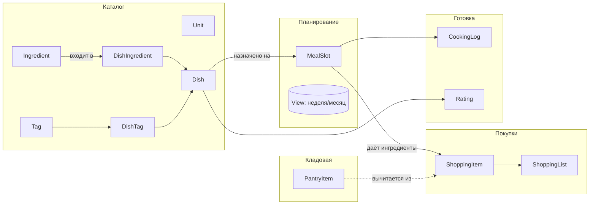

# Food Service: расширенная модель данных (v2)

> Контекст: одна пара = один household. Документ дополняет
> [`food-service-architecture.md`](food-service-architecture.md) и описывает
> «как разложить домен на модели», чтобы потом подключить **Finance** и
> следующие сервисы superapp.

Цели:

1. Чисто разнести сущности (нет «всё в одной таблице»).
2. Иметь нормализованный справочник продуктов — основу для бюджета и аналитики.
3. Сохранить MVP-простоту: пока поля могут быть `nullable`, но точки расширения уже видны.
4. Заложить **точки интеграции** с Finance, Health, Travel.

---

## 1. Карта доменов



Все сущности живут под одним `household_id` (можно опустить в коде до миграции на multi-tenant, оставить дефолт `1`).

---

## 2. Сущности

### 2.1 Каталог

| Сущность | Поля (минимум) | Зачем |
|----------|----------------|-------|
| **`Unit`** | `id`, `code` (`g`, `ml`, `pcs`, `tbsp`, `tsp`, `cup`), `name`, `system` (`metric`/`imperial`), `base_unit_id?`, `factor_to_base?` | Единый справочник единиц; конвертация (1 cup → 240 ml). |
| **`Ingredient`** | `id`, `name`, `default_unit_id`, `category` (`vegetable`, `meat`, `dairy`, …), `kcal_per_100g?`, `is_perishable`, `notes?` | Один продукт = одна запись. Основа для pantry, списка покупок, питания. |
| **`Dish`** (бывший `FoodDish`) | `id`, `title`, `description?`, `recipe_text?`, `instructions_md?`, `servings_default`, `prep_minutes?`, `cook_minutes?`, `meal_category_id`, `image_url?`, `is_archived`, `created_at`, `updated_at` | Готовое блюдо/рецепт. `recipe_text` остаётся для свободной формы (как сейчас). |
| **`DishIngredient`** | `id`, `dish_id`, `ingredient_id`, `quantity`, `unit_id`, `is_optional`, `note?`, `sort_order` | Состав. Позволит масштабировать на порции и собирать списки покупок. |
| **`Tag`** | `id`, `name`, `color?` | Метки: «vegan», «быстро», «детям», «festive». |
| **`DishTag`** | `dish_id`, `tag_id` (PK составной) | Многие-ко-многим. |

> `MealCategory` (Завтрак/Обед/Ужин/Перекус) уже есть — используем как сейчас. Можно потом добавить `is_default` чтобы автосид трогал только пустую БД.

### 2.2 Кладовая

| Сущность | Поля | Зачем |
|----------|------|-------|
| **`PantryItem`** | `id`, `ingredient_id`, `quantity`, `unit_id`, `expires_on?`, `location?` (`fridge`/`freezer`/`shelf`), `updated_at` | Что есть дома; вычитается при генерации списка. |

### 2.3 Планирование

| Сущность | Поля | Зачем |
|----------|------|-------|
| **`MealSlot`** | `id`, `date` (date), `slot` (`breakfast` / `lunch` / `dinner` / `snack` / `custom`), `meal_category_id?`, `dish_id?`, `custom_title?`, `servings`, `notes?`, `cooked_at?` | Одна ячейка календаря. `dish_id` или свободный текст. |
| Календарь | View поверх `MealSlot` (без отдельной таблицы) с фильтром `date BETWEEN`. | Неделя/месяц — это запросы, не отдельные таблицы. |
| **`MealPlanTemplate`** (фаза 2) | `id`, `name`, `description?` | «Рабочая неделя», «гости» — шаблон. |
| **`MealPlanTemplateSlot`** (фаза 2) | `id`, `template_id`, `weekday` (0–6), `slot`, `dish_id?`, `custom_title?` | Шаблонная сетка, копируется в `MealSlot` при применении. |

### 2.4 Покупки

| Сущность | Поля | Зачем |
|----------|------|-------|
| **`ShoppingList`** | `id`, `title`, `period_start?`, `period_end?`, `status` (`draft`/`active`/`done`), `created_at` | Список на период или произвольный. |
| **`ShoppingItem`** | `id`, `list_id`, `ingredient_id?`, `label?` (если без справочника), `quantity?`, `unit_id?`, `is_checked`, `source` (`manual` / `from_menu` / `from_pantry`), `source_meal_slot_id?`, `actual_price?`, `currency?` | Позиция списка. `actual_price` потом уйдёт в Finance. |

### 2.5 Готовка и фидбек (опционально)

| Сущность | Поля | Зачем |
|----------|------|-------|
| **`CookingLog`** | `id`, `meal_slot_id`, `cooked_at`, `actual_servings?`, `notes?` | Что реально приготовили (для аналитики). |
| **`Rating`** | `id`, `dish_id`, `score` (1–5), `comment?`, `created_at` | Рейтинг блюд (общие данные пары). |

---

## 3. Соответствие текущей реализации

| Сейчас в коде | Что меняется в v2 |
|---------------|-------------------|
| `FoodMealCategory` | Остаётся, без изменений (или + `is_default`). |
| `FoodDish` (`title`, `recipe_text`) | Переименуется в `Dish`, добавятся `description`, `servings_default`, `prep_minutes`, `cook_minutes`, `image_url`. `recipe_text` остаётся как «свободный рецепт». |
| Связь блюдо↔ингредиент | Новая `DishIngredient` + `Ingredient`. Старый `recipe_text` живёт параллельно: сначала текст, потом постепенно структурированные ингредиенты. |
| `MVP_HOUSEHOLD_ID = 1` | Оставляем, но во всех новых таблицах пишем колонку `household_id` сразу. |

Миграция плавная: `Dish` совместим со старым `FoodDish` (только новые поля nullable). `DishIngredient`, `Ingredient`, `Unit`, `Tag`, `MealSlot`, `ShoppingList/Item`, `PantryItem` — новые таблицы.

---

## 4. Точки интеграции с другими сервисами

### 4.1 Finance

Цель — **«сколько мы тратим на еду»** без ручного ввода.

- **Категория «Продукты»** в Finance уже существует (или легко завести).
- Когда `ShoppingList.status = done` и в позициях есть `actual_price`, можно создать **черновик транзакции** в Finance:
  - сумма = `Σ actual_price`,
  - категория = «Продукты»,
  - комментарий = `"Список: <title> (yyyy-mm-dd)"`,
  - связь хранится в `ShoppingList.linked_transaction_id` (nullable).
- Двусторонняя ссылка не обязательна на MVP; достаточно односторонней (Food → Finance).

Расширение:

- **Бюджет на еду на неделю**: Finance отдаёт лимит, Food предупреждает в UI.
- **AI-меню по бюджету**: «уложись в 30 000 ₸ на 7 ужинов».

### 4.2 Health (когда появится)

- `Ingredient.kcal_per_100g`, `protein/fat/carbs_per_100g` (фаза 2) → расчёт КБЖУ блюда (`DishIngredient.quantity` × `unit.factor` × `kcal_per_100g`).
- `MealSlot.servings` × КБЖУ блюда = дневная статистика для Health.

### 4.3 Travel

- Шаблоны меню «в дорогу», pantry → чек-лист «взять с собой».
- Не критично для MVP, просто помним о связке.

### 4.4 Общий слой

Где будет общий код, когда вертикалей станет 3+:

- `app/shared/` — общий `household`/`workspace`, `Money` (сумма + валюта),
  утилиты времени, доменные ошибки.
- `app/integrations/finance.py` (вызывается Food) — фасад, чтобы Food не лез
  напрямую в таблицы Finance, а только через явный интерфейс
  (создать черновик транзакции, спросить лимит на категорию).

---

## 5. API набросок (v2)

REST под `/food`:

- **Каталог**
  - `GET/POST /food/ingredients` — справочник продуктов (поиск по `?q=`).
  - `GET/POST/PATCH/DELETE /food/dishes`, `dishes/{id}/ingredients` — состав.
  - `GET /food/units`, `GET /food/tags`.
- **Меню**
  - `GET /food/menu?from=YYYY-MM-DD&to=YYYY-MM-DD` — слоты за период.
  - `POST /food/menu/slots`, `PATCH /food/menu/slots/{id}`.
  - `POST /food/menu/templates/{id}/apply` — наложить шаблон на неделю.
- **Кладовая**
  - `GET/POST/PATCH/DELETE /food/pantry`.
- **Покупки**
  - `GET/POST /food/shopping-lists`, `POST /food/shopping-lists/{id}/generate?from&to` — собрать из меню (минус кладовая).
  - `PATCH /food/shopping-items/{id}` — `is_checked`, `actual_price`.
  - `POST /food/shopping-lists/{id}/finalize` — закрыть и опционально создать транзакцию в Finance (флаг в теле).
- **Готовка** (поздняя фаза)
  - `POST /food/cooking-log`, `POST /food/dishes/{id}/rate`.

---

## 6. Структура кода (бэкенд)

Поддерживаем уже существующее разделение, делим внутри `app/food/`:

```text
app/food/
  __init__.py
  router.py                # тонкий: подключает sub-routers
  models/
    __init__.py
    catalog.py             # Unit, Ingredient, Dish, DishIngredient, Tag, DishTag
    pantry.py              # PantryItem
    plan.py                # MealSlot, MealPlanTemplate, MealPlanTemplateSlot
    shop.py                # ShoppingList, ShoppingItem
    cook.py                # CookingLog, Rating
  schemas/
    catalog.py
    pantry.py
    plan.py
    shop.py
    cook.py
  routers/
    catalog.py             # /food/ingredients, /food/dishes, /food/units, /food/tags
    plan.py                # /food/menu/*
    pantry.py              # /food/pantry
    shop.py                # /food/shopping-lists, /food/shopping-items
    cook.py                # /food/cooking-log, /food/rate
  services/
    shopping_generator.py  # из меню + pantry → черновик списка
    nutrition.py           # КБЖУ из ингредиентов (фаза 2)
    finance_bridge.py      # вызывает интерфейс Finance
```

Frontend параллельно:

```text
src/food/
  pages/
    FoodCatalogPage.tsx       # сейчас
    FoodMenuPage.tsx          # календарь
    FoodIngredientsPage.tsx   # справочник продуктов
    FoodPantryPage.tsx
    FoodShoppingPage.tsx
  components/
    DishCard.tsx
    IngredientPicker.tsx
    MenuWeekGrid.tsx
    ShoppingItemRow.tsx
```

---

## 7. Постепенный план миграции

1. **Сейчас:** оставляем `FoodMealCategory` + `FoodDish (recipe_text)`.
2. **Шаг 1 (мини):** добавить `Ingredient`, `Unit`, `DishIngredient`. UI: редактор ингредиентов под существующий `recipe_text`.
3. **Шаг 2:** `MealSlot` + UI «Меню недели» (заменяет текущую заглушку).
4. **Шаг 3:** `ShoppingList`, `ShoppingItem`, генератор списка из меню.
5. **Шаг 4:** `PantryItem` и вычитание из списка.
6. **Шаг 5:** мост в Finance (`finance_bridge.py`) — создание транзакции из закрытого списка.
7. **Шаг 6+:** теги, рейтинги, шаблоны недели, КБЖУ для Health.

На каждом шаге — отдельная Alembic-миграция и обратная совместимость с предыдущим UI.

---

## 8. Открытые вопросы

- **Валюта/деньги** в Food: хранить ли `actual_price` сразу мультивалютно (`amount_minor`, `currency`) или брать одну дефолтную из Finance?
- **Конвертация единиц** при суммировании: нужны ли «правила перевода» по продукту (помидор: `pcs ≈ 120 g`) или ограничимся одинаковой единицей?
- **Скрытые ингредиенты** (соль/перец/масло): помечать `is_pantry_default` и не тащить в список покупок?
- **Удаление блюда**, на которое уже стоит в `MealSlot`: запрещать или soft-delete (`is_archived`)?

После ответов на эти 3–4 пункта v2 готова к реализации.
