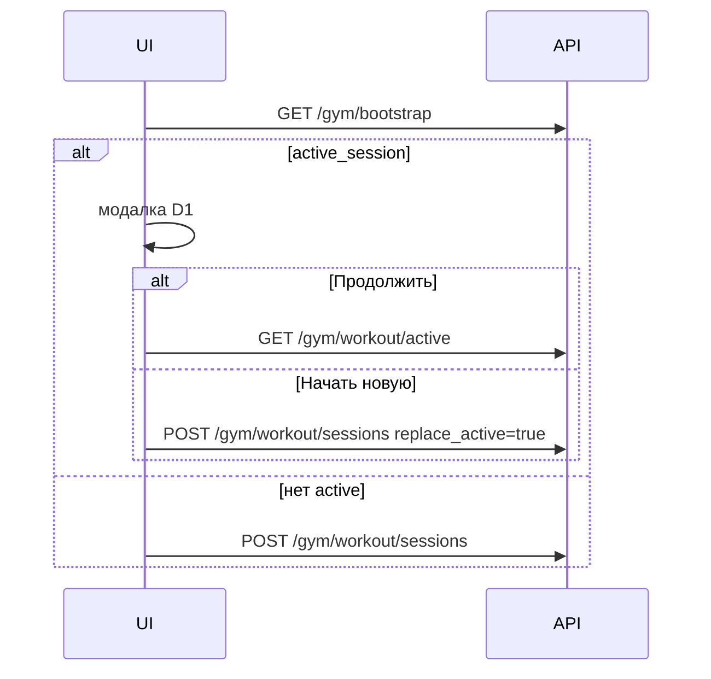
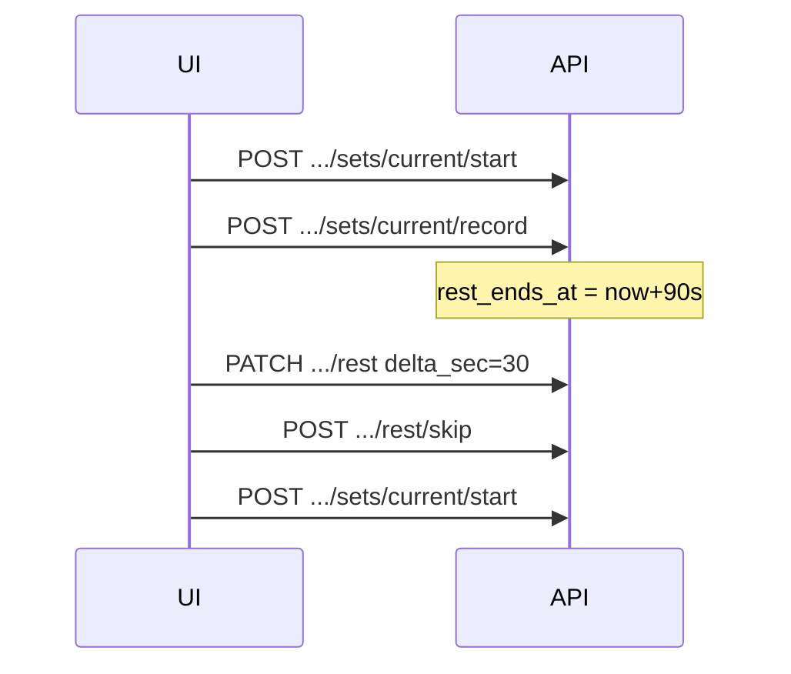

`# API — Gym (Health)

**Статус:** спека под MVP (реализация — `app.gym`, TBD).  
Основа: [data-model.md](./data-model.md), сценарии [user-stories.md](./user-stories.md), [D1–D5](./decisions.md).

---

## Общее

| Параметр | Значение |
|----------|----------|
| Base path | `/gym` |
| Auth | `Authorization: Bearer <jwt>` — как Finance/Food (`get_current_user`) |
| Scope | Все мутации и выборки — только `current_user.id` |
| Формат | JSON, `Content-Type: application/json` |
| Время | ISO 8601 UTC (`2026-05-24T18:30:00Z`) |
| Ошибки | FastAPI: `{ "detail": "..." }` или `{ "detail": [{...}] }` |

Подключение в `main.py` (план):

```python
app.include_router(gym_router)  # prefix="/gym"
```

---

## Карта эндпоинтов

| Группа | Метод | Path | Сценарии |
|--------|-------|------|----------|
| Bootstrap | `GET` | `/gym/bootstrap` | H-2, G-9, G-10 |
| Категории | `GET` | `/gym/exercise-categories` | G-5 |
| Упражнения | `GET` | `/gym/exercises` | G-5, G-5s |
| | `POST` | `/gym/exercises` | G-6 |
| | `PATCH` | `/gym/exercises/{exercise_id}` | G-6 |
| | `GET` | `/gym/exercises/{exercise_id}/archive-preview` | G-7, [D4] |
| | `POST` | `/gym/exercises/{exercise_id}/archive` | G-7, [D4] |
| | `POST` | `/gym/exercises/{exercise_id}/unarchive` | G-8 |
| Программа | `GET` | `/gym/program` | G-1, G-1z |
| Дни | `POST` | `/gym/program/days` | G-1, G-2 |
| | `PATCH` | `/gym/program/days/{day_id}` | G-2 |
| | `DELETE` | `/gym/program/days/{day_id}` | G-2 |
| | `PUT` | `/gym/program/days/order` | G-2 |
| План в дне | `GET` | `/gym/program/days/{day_id}` | G-3 |
| | `POST` | `/gym/program/days/{day_id}/exercises` | G-3 |
| | `PATCH` | `/gym/program/days/{day_id}/exercises/{line_id}` | G-4 |
| | `DELETE` | `/gym/program/days/{day_id}/exercises/{line_id}` | G-4 |
| | `PUT` | `/gym/program/days/{day_id}/exercises/order` | G-3d |
| Поход | `GET` | `/gym/workout/active` | G-9, G-12 |
| | `DELETE` | `/gym/workout/active` | G-9 [D1] |
| | `POST` | `/gym/workout/sessions` | G-10 |
| | `POST` | `/gym/workout/active/complete` | G-14 |
| | `POST` | `/gym/workout/active/select-exercise` | G-11 |
| | `POST` | `/gym/workout/active/exercises/{session_exercise_id}/skip` | G-12 |
| Подход | `POST` | `/gym/workout/active/sets/current/start` | G-12 |
| | `POST` | `/gym/workout/active/sets/current/record` | G-12, [D2][D3] |
| | `POST` | `/gym/workout/active/sets/current/skip` | G-12 |
| | `POST` | `/gym/workout/active/sets/current/undo-start` | G-12 |
| Отдых | `POST` | `/gym/workout/active/rest/start` | G-12 |
| | `PATCH` | `/gym/workout/active/rest` | G-12 (+30/−15) |
| | `POST` | `/gym/workout/active/rest/skip` | G-12 |
| История | `GET` | `/gym/workout/sessions` | G-20 |
| | `GET` | `/gym/workout/sessions/{session_id}` | G-20, G-21 |

---

## Bootstrap

### `GET /gym/bootstrap`

Лёгкий вход при открытии Gym: есть ли активная сессия, пустая ли программа, подсказка для G-10.

**Response `200`:**

```json
{
  "active_session": {
    "id": 42,
    "started_at": "2026-05-24T10:15:00Z",
    "day_label": "B"
  },
  "last_completed_day_label": "A",
  "program": {
    "has_days": true,
    "day_count": 3
  }
}
```

| Поле | Когда `null` |
|------|----------------|
| `active_session` | Нет активной сессии [D1] |
| `last_completed_day_label` | Ни одной завершённой сессии [G-10] |
| `program.has_days` | `false` → zero state G-1z |

---

## Категории упражнений

### `GET /gym/exercise-categories`

Список общих категорий (read-only). Сортировка по `sort_order`.

**Response `200`:** `ExerciseCategory[]`

```json
[
  { "id": 1, "code": "arms", "name_ru": "Руки", "name_en": "Arms", "sort_order": 1 }
]
```

---

## Упражнения (каталог)

### `GET /gym/exercises`

| Query | Тип | Описание |
|-------|-----|----------|
| `category_id` | int? | Фильтр по категории [G-5] |
| `q` | string? | Поиск по `name_ru` / `name_en` (ILIKE) [G-5s] |
| `archived` | bool | default `false`; `true` — раздел «Архив» [G-8] |

**Response `200`:** `Exercise[]`

```json
[
  {
    "id": 10,
    "category_id": 1,
    "name_ru": "Жим лёжа",
    "name_en": "Bench press",
    "archived_at": null,
    "created_at": "2026-05-20T12:00:00Z"
  }
]
```

---

### `POST /gym/exercises`

**Body:**

```json
{
  "category_id": 1,
  "name_ru": "Жим лёжа",
  "name_en": "Bench press"
}
```

**Response `201`:** `Exercise`

**Errors:** `422` — пустые имена; `404` — нет категории.

*Дубликат названия у себя — TBD (пока разрешить без проверки).*

---

### `PATCH /gym/exercises/{exercise_id}`

**Body** (все поля опциональны):

```json
{
  "category_id": 2,
  "name_ru": "Жим",
  "name_en": "Bench"
}
```

**Response `200`:** `Exercise`  
**Errors:** `404` — не найдено / чужое.

---

### `GET /gym/exercises/{exercise_id}/archive-preview`

Перед архивацией [D4]: в каких днях программы используется упражнение.

**Response `200`:**

```json
{
  "exercise_id": 10,
  "used_in_program": true,
  "program_day_labels": ["B", "C"]
}
```

`used_in_program: false` → модалку предупреждения не показываем.

---

### `POST /gym/exercises/{exercise_id}/archive`

Архив [G-7, D4]: `archived_at = now()`, удаление строк из `gym_program_day_exercises`.

**Response `200`:** `Exercise` (с `archived_at`).

**Errors:** `404`, `409` — уже в архиве.

---

### `POST /gym/exercises/{exercise_id}/unarchive`

**Response `200`:** `Exercise` (`archived_at = null`) [G-8].

---

## Программа

Одна программа на пользователя [D5]. При первом `POST .../days` программа создаётся неявно (`get_or_create_program`).

### `GET /gym/program`

**Response `200`:**

```json
{
  "id": 1,
  "days": [
    {
      "id": 101,
      "label": "A",
      "sort_order": 0,
      "exercise_count": 5
    }
  ]
}
```

Пустая программа: `{ "id": 1, "days": [] }` (или `404` + фронт показывает G-1z — **рекомендация:** всегда `200` с пустым `days`).

---

### `POST /gym/program/days`

**Body:**

```json
{ "label": "B", "sort_order": 1 }
```

`sort_order` опционален — в конец списка.

**Response `201`:** `ProgramDay` (без вложенных упражнений).

**Errors:** `409` — дубликат `label` в программе.

---

### `PATCH /gym/program/days/{day_id}`

**Body:** `{ "label": "Push" }`

**Response `200`:** `ProgramDay`

---

### `DELETE /gym/program/days/{day_id}`

Удаляет день и план (`CASCADE`). История сессий не меняется [G-2].

**Response `204`**

**Errors:** `404`; при непустом дне фронт уже показал confirm — бэкенд удаляет без доп. флага.

---

### `PUT /gym/program/days/order`

**Body:**

```json
{ "day_ids": [103, 101, 102] }
```

Полный порядок дней. **Response `200`:** `ProgramDay[]`

---

### `GET /gym/program/days/{day_id}`

День с планом (для экрана «Моя программа» и выбора упражнений G-3).

**Response `200`:**

```json
{
  "id": 101,
  "label": "A",
  "sort_order": 0,
  "exercises": [
    {
      "id": 501,
      "exercise_id": 10,
      "name_ru": "Жим лёжа",
      "name_en": "Bench press",
      "planned_sets": 3,
      "planned_reps": 10,
      "sort_order": 0
    }
  ]
}
```

---

### `POST /gym/program/days/{day_id}/exercises`

**Body:**

```json
{
  "exercise_id": 10,
  "planned_sets": 3,
  "planned_reps": 10
}
```

**Response `201`:** `ProgramDayExerciseLine`

**Errors:** `404` — день / упражнение; `409` — упражнение уже в этом дне; `400` — упражнение в архиве.

---

### `PATCH /gym/program/days/{day_id}/exercises/{line_id}`

**Body:** `{ "planned_sets": 4, "planned_reps": 8 }`

**Response `200`:** `ProgramDayExerciseLine` [G-4]

---

### `DELETE /gym/program/days/{day_id}/exercises/{line_id}`

**Response `204`**

---

### `PUT /gym/program/days/{day_id}/exercises/order`

**Body:**

```json
{ "line_ids": [503, 501, 502] }
```

**Response `200`:** `ProgramDayExerciseLine[]` [G-3d]

---

## Активный поход (сессия)

Синглтон **`/gym/workout/active`** — не больше одной `active` сессии [D1].

### `GET /gym/workout/active`

Полное состояние для resume и экрана подхода [G-9, G-12].

**Response `200`:**

```json
{
  "id": 42,
  "status": "active",
  "day_label": "B",
  "program_day_id": 102,
  "started_at": "2026-05-24T10:15:00Z",
  "current": {
    "session_exercise_id": 901,
    "set_number": 2,
    "phase": "rest",
    "rest_ends_at": "2026-05-24T10:18:30Z"
  },
  "exercises": [
    {
      "id": 901,
      "exercise_id": 10,
      "name_ru": "Жим лёжа",
      "name_en": "Bench press",
      "planned_sets": 3,
      "planned_reps": 10,
      "status": "in_progress",
      "sort_order": 0,
      "previous_weight_kg": 62.5,
      "sets": [
        {
          "id": 1001,
          "set_number": 1,
          "status": "completed",
          "weight_kg": 60,
          "reps": 10,
          "recorded_at": "2026-05-24T10:16:00Z"
        },
        {
          "id": 1002,
          "set_number": 2,
          "status": "pending",
          "weight_kg": null,
          "reps": null,
          "recorded_at": null
        }
      ]
    }
  ],
  "progress": { "done": 0, "total": 5 }
}
```

| `current.phase` | UI |
|-----------------|-----|
| `idle` | «Ожидание», кнопка «Начать подход» |
| `in_set` | «Подход идёт» |
| `rest` | Таймер отдыха |

`current` может быть `null` до выбора первого упражнения (после G-10, до G-11).

**Response `404`:** нет активной сессии.

---

### `DELETE /gym/workout/active`

Удаляет активную сессию и дочерние записи [G-9 «начать новую», D1].

**Response `204`**  
**Response `404`:** нечего удалять.

---

### `POST /gym/workout/sessions`

Старт похода [G-10]: снимок дня, создание `session_exercises` и `sets`.

**Body:**

```json
{
  "program_day_id": 102,
  "replace_active": false
}
```

| Поле | Описание |
|------|----------|
| `replace_active` | `true` — сначала DELETE активной, затем создать новую [D1] в одной транзакции |

**Response `201`:** то же, что `GET /gym/workout/active` (без `current` или `phase: idle`).

**Errors:**

| Код | Когда |
|-----|--------|
| `409` | Уже есть `active` и `replace_active=false` — тело для модалки G-9 |
| `404` | `program_day_id` не найден |
| `400` | День без упражнений — *разрешить старт с пустым планом или 400 — TBD* |

**`409` body (пример):**

```json
{
  "detail": "active_session_exists",
  "active_session": {
    "id": 42,
    "started_at": "2026-05-24T10:15:00Z",
    "day_label": "B"
  }
}
```

---

### `POST /gym/workout/active/select-exercise`

Выбор текущего упражнения [G-11]. Сбрасывает `current` на первый pending подход.

**Body:**

```json
{ "session_exercise_id": 901 }
```

**Response `200`:** `WorkoutActive` (обновлённый `GET /active`).

**Errors:** `404`, `400` — упражнение уже `completed`/`skipped`.

---

### `POST /gym/workout/active/exercises/{session_exercise_id}/skip`

Пропуск всего упражнения [G-12, ⋯]. Все `pending` подходы → `skipped`, статус упражнения → `skipped`.

**Response `200`:** `WorkoutActive` — переход к G-13 (`current` = null или следующий экран «что дальше»).

---

## Подход (текущий)

Сервер опирается на `session.current_session_exercise_id` + `current_set_number`. «Текущий» подход — первый `pending` в упражнении `in_progress`, если не задан явно.

### `POST /gym/workout/active/sets/current/start`

«Начать подход» [G-12]: `phase` → `in_set`, упражнение → `in_progress`.

**Response `200`:** `WorkoutActive`

**Errors:** `400` — нет выбранного упражнения; подход уже `in_set`.

---

### `POST /gym/workout/active/sets/current/undo-start`

«Назад» с «Подход идёт» → «Ожидание» [G-12].

**Response `200`:** `WorkoutActive`, `phase: idle`

---

### `POST /gym/workout/active/sets/current/record`

«Сохранить» вес и повторения [G-12, D2, D3].

**Body:**

```json
{
  "weight_kg": 60,
  "reps": 12
}
```

| Поле | Правила |
|------|---------|
| `weight_kg` | optional, `null` или `>= 0` [D2] |
| `reps` | required, `>= 0` [D3] |

Подход → `completed`. Если есть ещё `pending` подходы — **автоматически** `POST` логика старта отдыха: `rest_ends_at = now + 90s`, `phase: rest` [MVP 90 сек].

Если подход последний — упражнение → `completed`, `current` очищается → UI G-13.

**Response `200`:** `WorkoutActive`

---

### `POST /gym/workout/active/sets/current/skip`

Пропуск подхода [G-12]. Подход → `skipped`, **отдых не стартует**, сразу следующий `pending` / G-13.

**Response `200`:** `WorkoutActive`

---

## Отдых

Таймер в основном на клиенте; сервер хранит `rest_ends_at` для resume [data-model].

### `POST /gym/workout/active/rest/start`

Явный старт отдыха (если не вызван из `record`). Default **90** сек.

**Body (optional):**

```json
{ "duration_sec": 90 }
```

**Response `200`:** `WorkoutActive`, `phase: rest`

---

### `PATCH /gym/workout/active/rest`

Сдвиг конца отдыха [G-12 +30/−15].

**Body:**

```json
{ "delta_sec": 30 }
```

Пересчёт: `rest_ends_at += delta_sec` (не раньше `now` — опционально clamp).

**Response `200`:** `WorkoutActive`

---

### `POST /gym/workout/active/rest/skip`

«Пропустить отдых» → `rest_ends_at = null`, `phase: idle`.

**Response `200`:** `WorkoutActive`

---

### `POST /gym/workout/active/complete`

Завершить поход [G-14]. `status: completed`, `completed_at`, очистка `current` / `rest`.

**Response `200`:**

```json
{
  "id": 42,
  "status": "completed",
  "day_label": "B",
  "started_at": "2026-05-24T10:15:00Z",
  "completed_at": "2026-05-24T11:05:00Z",
  "summary": {
    "exercises": [
      {
        "session_exercise_id": 901,
        "name_ru": "Жим лёжа",
        "status": "completed",
        "sets_completed": 3,
        "sets_skipped": 0
      },
      {
        "session_exercise_id": 902,
        "name_ru": "Присед",
        "status": "skipped",
        "sets_completed": 0,
        "sets_skipped": 4
      }
    ]
  }
}
```

*Завершить без единого подхода — разрешено [TBD в data-model].*

После `complete` активной сессии нет; следующий `GET /bootstrap` → `active_session: null`.

---

## История

### `GET /gym/workout/sessions`

Список завершённых походов [G-20].

| Query | Default | Описание |
|-------|---------|----------|
| `limit` | 20 | max 50 |
| `offset` | 0 | |

**Response `200`:**

```json
{
  "items": [
    {
      "id": 41,
      "day_label": "A",
      "started_at": "2026-05-22T18:00:00Z",
      "completed_at": "2026-05-22T19:10:00Z"
    }
  ],
  "total": 15
}
```

Только `status = completed`, сортировка `completed_at DESC`.

---

### `GET /gym/workout/sessions/{session_id}`

Детали похода [G-20, G-21]: план vs факт, пропуски.

**Response `200`:** структура как `WorkoutActive`, но `status: completed`, без `current` / `phase`, все упражнения и подходы финальные.

**Errors:** `404` — чужая или активная (активную смотреть через `/active`).

---

## Типы (Pydantic, ориентир)

```python
class ExerciseCategoryResponse(BaseModel):
    id: int
    code: str
    name_ru: str
    name_en: str
    sort_order: int

class ExerciseResponse(BaseModel):
    id: int
    category_id: int
    name_ru: str
    name_en: str
    archived_at: datetime | None
    created_at: datetime

class ProgramDayExerciseLineResponse(BaseModel):
    id: int
    exercise_id: int
    name_ru: str
    name_en: str
    planned_sets: int
    planned_reps: int
    sort_order: int

class WorkoutSetResponse(BaseModel):
    id: int
    set_number: int
    status: Literal["pending", "completed", "skipped"]
    weight_kg: Decimal | None
    reps: int | None
    recorded_at: datetime | None

class WorkoutSessionExerciseResponse(BaseModel):
    id: int
    exercise_id: int
    name_ru: str
    name_en: str
    planned_sets: int
    planned_reps: int
    status: Literal["pending", "in_progress", "completed", "skipped"]
    sort_order: int
    previous_weight_kg: Decimal | None  # только в active
    sets: list[WorkoutSetResponse]

class WorkoutCurrentPointer(BaseModel):
    session_exercise_id: int
    set_number: int
    phase: Literal["idle", "in_set", "rest"]
    rest_ends_at: datetime | None

class WorkoutActiveResponse(BaseModel):
    id: int
    status: Literal["active"]
    day_label: str
    program_day_id: int | None
    started_at: datetime
    current: WorkoutCurrentPointer | None
    exercises: list[WorkoutSessionExerciseResponse]
    progress: dict  # { "done": int, "total": int }
```

---

## Коды ошибок (сводка)

| HTTP | `detail` / смысл |
|------|------------------|
| `401` | Нет / невалидный токен |
| `404` | Ресурс не найден или не ваш |
| `409` | Конфликт: активная сессия, дубликат label/упражнения в дне |
| `422` | Валидация Pydantic |
| `400` | Бизнес-правило: архивное упражнение в план, неверная фаза подхода |

---

## Потоки (sequence)

### Вход в Gym [G-9, G-10]



### Подход [G-12]



---

## Связь с решениями

| ID | API |
|----|-----|
| [D1] | `409` + `replace_active`; `DELETE /active`; `GET /active` для resume |
| [D2] | `weight_kg` optional, `>= 0` в `record` |
| [D3] | `reps` без max от `planned_reps` |
| [D4] | `archive-preview` + `POST archive` |
| [D5] | Нет `program_id` в URL — одна программа на user |

---

## V2 (не в MVP API)

- `PATCH /gym/settings` — отдых 60/120
- Несколько программ — CRUD `/gym/programs`
- График веса — `GET /gym/exercises/{id}/weight-history`

---

## История правок

| Дата | Изменение |
|------|-----------|
| 2026-05-24 | Первая версия: `/gym`, bootstrap, каталог, программа, active workout, история |
  1`