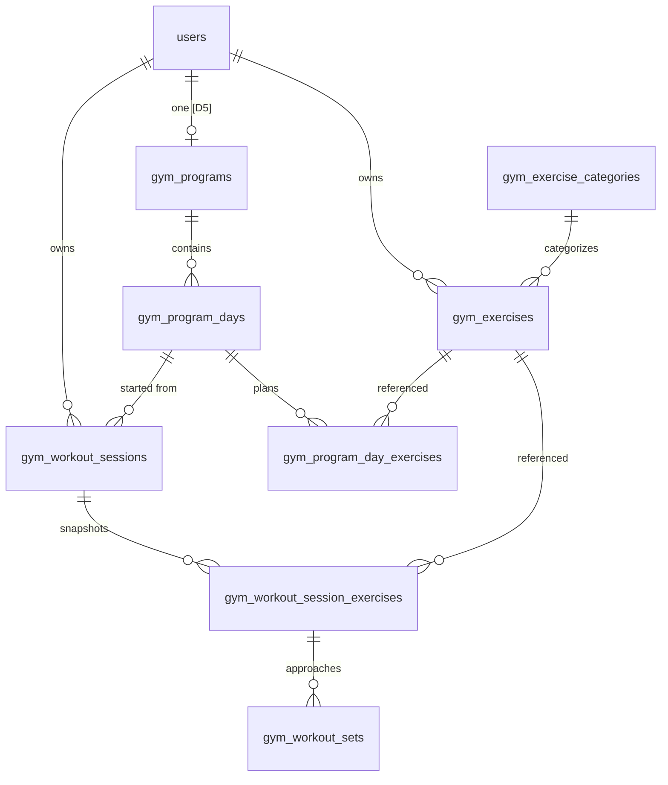
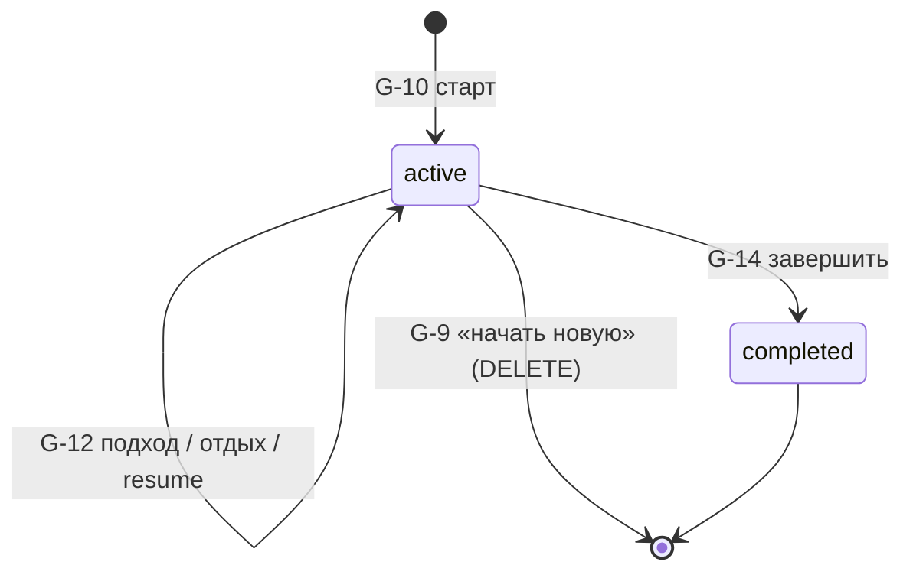

# Data model — Gym (Health)

**Статус:** черновик под MVP.  
Основа: [user-stories.md](./user-stories.md), решения [D1–D5](./decisions.md).

---

## Обзор



**Принципы:**

| Слой | Жизненный цикл | Изменения после старта похода |
|------|----------------|------------------------------|
| Категории | Общие, сидируем мы | — |
| Упражнения | Личные, `user_id` | Архив не трогает историю [D4] |
| Программа | Личная, одна на пользователя [D5] | Прошлые сессии не переписываются |
| Сессия | Активная → завершённая | План **снимок** на момент старта |

---

## Сущности

### `gym_exercise_categories` — категории (общие)

Сидируются при деплое / bootstrap. Пользователь не создаёт.

| Поле | Тип | Описание |
|------|-----|--------|
| `id` | PK | |
| `code` | string, unique | Стабильный ключ (`arms`, `legs`, …) |
| `name_ru` | string | «Руки», «Ноги», … |
| `name_en` | string | «Arms», «Legs», … |
| `sort_order` | int | Порядок в UI |

**MVP seed:** Руки, Ноги, Кор, Грудь, Спина, Ягодицы (RU + EN).

---

### `gym_exercises` — упражнения (личные)

Только у создавшего пользователя; чужие не видны.

| Поле | Тип | Описание |
|------|-----|--------|
| `id` | PK | |
| `user_id` | FK → `users.id` | Владелец |
| `category_id` | FK → `gym_exercise_categories.id` | |
| `name_ru` | string | Поиск [G-5s] |
| `name_en` | string | Поиск [G-5s] |
| `archived_at` | timestamptz, nullable | `NULL` = активное; иначе в архиве [G-7] |
| `created_at` | timestamptz | |
| `updated_at` | timestamptz | |

**Индексы:** `(user_id, archived_at)`, `(user_id)` + GIN/trigram на `name_ru`, `name_en` (если Postgres).

**Архив [D4]:** при `archived_at IS NOT NULL` — удалить все строки `gym_program_day_exercises` с этим `exercise_id`. История сессий **не** меняется (FK на упражнение остаётся).

**Разархив [G-8]:** `archived_at = NULL`.

---

### `gym_programs` — программа (одна на пользователя) [D5]

| Поле | Тип | Описание |
|------|-----|--------|
| `id` | PK | |
| `user_id` | FK → `users.id`, **unique** | Одна программа на MVP |
| `created_at` | timestamptz | |
| `updated_at` | timestamptz | |

**Constraint:** `UNIQUE (user_id)`.

---

### `gym_program_days` — дни A, B, C…

| Поле | Тип | Описание |
|------|-----|--------|
| `id` | PK | |
| `program_id` | FK → `gym_programs.id` ON DELETE CASCADE | |
| `label` | string | «A», «B», «Push», … |
| `sort_order` | int | Порядок дней в программе |
| `created_at` | timestamptz | |

**Constraint:** `UNIQUE (program_id, label)`.

Удаление дня с упражнениями — каскад по `gym_program_day_exercises`. История прошлых походов хранит **снимок** `day_label` в сессии, не FK на удалённый день.

---

### `gym_program_day_exercises` — план в дне

Строка «упражнение + подходы × повторения»; порядок drag [G-3d].

| Поле | Тип | Описание |
|------|-----|--------|
| `id` | PK | |
| `program_day_id` | FK → `gym_program_days.id` ON DELETE CASCADE | |
| `exercise_id` | FK → `gym_exercises.id` | |
| `planned_sets` | smallint, > 0 | Число подходов |
| `planned_reps` | smallint, > 0 | План повторений на подход |
| `sort_order` | int | Drag-and-drop |
| `created_at` | timestamptz | |

**Constraint:** `UNIQUE (program_day_id, exercise_id)` — одно упражнение один раз **в этом дне**; в другом дне (B vs C) — отдельная строка [G-3].

---

### `gym_workout_sessions` — поход в зал

| Поле | Тип | Описание |
|------|-----|--------|
| `id` | PK | |
| `user_id` | FK → `users.id` | |
| `status` | enum | `active` \| `completed` |
| `program_day_id` | FK → `gym_program_days.id`, nullable | День на старте; может быть NULL если день удалили позже |
| `day_label` | string | Снимок «B» на момент старта [G-20] |
| `started_at` | timestamptz | Для модалки resume [D1] |
| `completed_at` | timestamptz, nullable | |
| `current_session_exercise_id` | FK → `gym_workout_session_exercises.id`, nullable | Resume: текущее упражнение |
| `current_set_number` | smallint, nullable | Resume: номер подхода (1-based) |
| `rest_ends_at` | timestamptz, nullable | Resume: конец отдыха; NULL если не на отдыхе |

**Constraint [D1]:** не больше одной `active` сессии на пользователя — partial unique index `(user_id) WHERE status = 'active'`.

**«Начать новую» [D1]:** `DELETE` активной сессии и всех дочерних записей (CASCADE).

**«Прошлый раз был день X» [G-10]:** последняя `completed` сессия по `completed_at DESC`.

---

### `gym_workout_session_exercises` — упражнение в сессии (снимок плана)

Копия плана дня на момент старта; не обновляется при правках программы [G-4, G-21].

| Поле | Тип | Описание |
|------|-----|--------|
| `id` | PK | |
| `session_id` | FK → `gym_workout_sessions.id` ON DELETE CASCADE | |
| `exercise_id` | FK → `gym_exercises.id` | Даже архивное — для истории |
| `planned_sets` | smallint | Снимок из плана |
| `planned_reps` | smallint | Снимок из плана |
| `sort_order` | int | Порядок в дне на старте сессии |
| `status` | enum | `pending` \| `in_progress` \| `completed` \| `skipped` | Упражнение целиком [G-13, G-14] |
| `exercise_name_ru` | string | Снимок названия |
| `exercise_name_en` | string | Снимок названия |

**Статус упражнения в сессии:**

| `status` | Когда |
|----------|-----|
| `pending` | Ещё не начинали |
| `in_progress` | Текущее в походе |
| `completed` | Все подходы записаны или пропущены |
| `skipped` | «Пропустить упражнение» [G-12] |

---

### `gym_workout_sets` — подход (факт)

Подходы идут по одному [G-12]; строки создаются при **старте сессии** (по `planned_sets`).

| Поле | Тип | Описание |
|------|-----|--------|
| `id` | PK | |
| `session_exercise_id` | FK → `gym_workout_session_exercises.id` ON DELETE CASCADE | |
| `set_number` | smallint, 1…N | «Подход K из N» |
| `status` | enum | `pending` \| `completed` \| `skipped` |
| `weight_kg` | numeric(6,2), nullable | [D2] `NULL` или `0` — без снаряда |
| `reps` | smallint, nullable | [D3] любое число; `NULL` если `skipped` |
| `recorded_at` | timestamptz, nullable | Момент сохранения результата |

**Constraint:** `UNIQUE (session_exercise_id, set_number)`.

**[D2]:** валидация API — `weight_kg IS NULL OR weight_kg >= 0`.

**[D3]:** `reps` без сравнения с `planned_reps`; без флагов «выше плана».

**Пропуск подхода [G-12]:** `status = skipped`, `weight_kg` и `reps` = NULL; отдых **не** стартует.

**Прошлый вес [MVP]:** вычисляемый запрос — последний `completed` set с тем же `exercise_id` у пользователя, `weight_kg IS NOT NULL`, `ORDER BY recorded_at DESC`. Не храним отдельно.

---

## Enum-ы

```text
workout_session_status:     active | completed
session_exercise_status:    pending | in_progress | completed | skipped
workout_set_status:         pending | completed | skipped
```

---

## Инварианты и решения

| ID | Правило в модели |
|----|----------------|
| [D1] | Partial unique `active` session; resume через `current_*` + `rest_ends_at`; новая сессия = delete старой |
| [D2] | `weight_kg` nullable, `>= 0` |
| [D3] | `reps` без cap относительно `planned_reps` |
| [D4] | `archived_at` + cascade delete из `gym_program_day_exercises`; сессии не трогаем |
| [D5] | `UNIQUE (user_id)` на `gym_programs` |

---

## Жизненный цикл сессии



**Старт [G-10]:**

1. Проверить активную сессию → G-9.
2. `INSERT gym_workout_sessions` (`active`, `day_label`, `program_day_id`).
3. Для каждой строки `gym_program_day_exercises` дня → `INSERT gym_workout_session_exercises` (снимок).
4. Для каждого упражнения → `INSERT planned_sets` строк в `gym_workout_sets` (`status = pending`).

**Завершение [G-14]:** `status = completed`, `completed_at = now()`, очистить `current_*`, `rest_ends_at`.

---

## Вычисляемые поля (не в БД)

| Поле | Где | Логика |
|------|-----|--------|
| Прошлый вес | G-12 | См. выше |
| Последний день | G-10 | Последняя `completed` сессия |
| Прогресс «N/M упражнений» | G-13 | `count(status != pending)` / `count(*)` по session_exercises |
| Итог сессии | G-14, G-20 | Агрегация `session_exercises` + `sets` |

---

## API-скoping

Все запросы Gym — по `user_id` из auth (Telegram → `users`). Категории — read-only для всех.  
Эндпоинты: [api.md](./api.md).

```
gym_exercises.user_id = current_user.id
gym_programs.user_id = current_user.id
gym_workout_sessions.user_id = current_user.id
```

Join на упражнение в сессии проверяет, что `gym_exercises.user_id = current_user.id`.

---

## Индексы (минимум)

| Таблица | Индекс |
|---------|--------|
| `gym_exercises` | `(user_id, archived_at)` |
| `gym_programs` | `UNIQUE (user_id)` |
| `gym_program_days` | `(program_id, sort_order)` |
| `gym_program_day_exercises` | `(program_day_id, sort_order)` |
| `gym_workout_sessions` | `(user_id, status)` partial unique active; `(user_id, completed_at DESC)` |
| `gym_workout_sets` | `(session_exercise_id, set_number)` |

---

## Открытые вопросы (из user-stories)

| # | Вопрос | Влияние на модель |
|---|--------|-------------------|
| 1 | G-8 разархив в первом релизе? | Только `archived_at`; без изменений схемы |
| 2 | Две `completed` сессии в один день? | Пока **разрешить** — нет unique по дате |
| 3 | Завершить без подходов? | Пока **разрешить** — сессия с пустыми / skipped sets |

---

## V2 (не в MVP-схеме)

| Фича | Заметка |
|------|--------|
| Несколько программ [D5] | Убрать `UNIQUE (user_id)`, добавить `is_active` |
| Настройка отдыха 60/120 | Поле в `users` или `gym_user_settings` |
| График веса | Только read по `gym_workout_sets` |

---

## Префикс таблиц

Как в Food (`food_*`): **`gym_*`**. Модуль бэкенда: `app.health` / `app.gym` — TBD при реализации.

---

## История правок

| Дата | Изменение |
|------|-----------|
| 2026-05-24 | Первая версия под D1–D5 и user stories G-1–G-21 |
