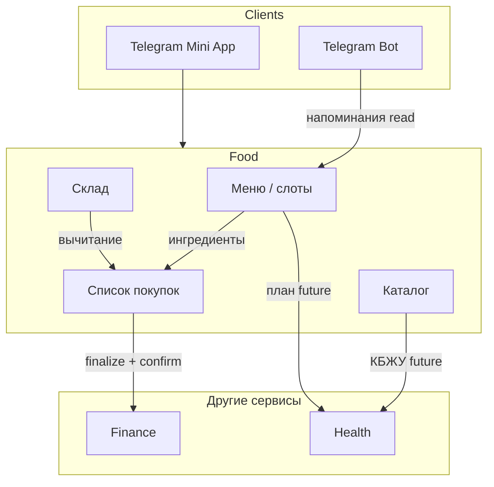

# Интеграции

## 1. Monty Core (общая платформа)

| Что общее | Как используется в Food |
|-----------|-------------------------|
| Auth (JWT / Telegram) | Все `/food/*` защищены как Finance |
| Household / workspace | Один `household_id` на пару из **auth-сессии** (как Finance); константа `MVP_HOUSEHOLD_ID` — убрать при реализации [D8](./decisions.md) |
| Shell «Все сервисы» | Точка входа в Food |
| Тема, локаль | Общие настройки приложения |

Food **не** вводит отдельную регистрацию.

---

## 2. Telegram

### Mini App

- Основной клиент: компактная навигация, safe area, haptic.
- Deep link: `?start=food_menu` / `food_shopping` (фаза 2) — открыть нужную вкладку.

### Bot / напоминания

| Событие | Сообщение |
|---------|-----------|
| Вечерний cron | Меню на завтра — **не чаще 1 сообщения в сутки** на дом [D9](./decisions.md) |
| Пустое меню на завтра | Nudge заполнить |
| Список (опц.) | «Не забудьте купить: …» — только если включено |

**Настройки:** время отправки, часовой пояс, получатели (оба chat_id дома).

**Не делаем на MVP:** инлайн-редактирование меню из бота (только просмотр + ссылка в Mini App).

### Будущее

- Голосовое «сегодня паста» → черновик слота (NLU).
- Фото холодильника → подсказки по кладовой (AI).

---

## 3. Finance

### Принцип

Food **генерирует намерение потратить**, Finance **хранит деньги**. Food не становится вторым учётом бюджета.

### MVP-мост

| Направление | Поведение |
|-------------|-----------|
| Food → Finance | По кнопке «Оформить покупку»: сумма из `actual_price` позиций или одна общая сумма → черновик/транзакция «Продукты» |
| Finance → Food | Только чтение: лимит категории «Продукты» для предупреждения в UI (фаза 2) |

### Данные

- В позиции списка: `actual_price` (decimal); валюта **одна** — из настроек Finance, не на позиции [D7](./decisions.md).
- В списке: `linked_transaction_id` (nullable).

### Сценарии

1. Закрыли список с ценами → одна трата на дату покупки.
2. Недельный бюджет на еду → при генерации меню badge «~в пределах / превышение» (оценка, фаза 3).

### Анти-паттерны

- Автоматически создавать трату без подтверждения.
- Дублировать все транзакции Finance в Food.

---

## 4. Health (будущая вертикаль)

| Данные Food | Использование Health |
|-------------|---------------------|
| `Ingredient` + КБЖУ на 100 г | Расчёт калорий блюда |
| `MealSlot` + порции | Дневник питания |
| `CookingLog` | Факт «съели», не план |

Food отдаёт **агрегаты по API**, Health не пишет в таблицы Food напрямую.

---

## 5. Travel (будущее)

- Шаблон «в дорогу» в меню.
- Экспорт кладовой в чек-лист «взять с собой».
- Низкий приоритет, только после стабильного MVP Food.

---

## 6. AI (OpenAI / аналог)

Уже есть инфраструктура в бэкенде Monty — подключать **опционально**.

| Требование | Реализация |
|------------|------------|
| Согласие | Toggle в настройках Food |
| Минимизация PII | В промпт только названия блюд/продуктов, без имён пользователей |
| Идемпотентность | AI предлагает черновик, пользователь сохраняет |

---

## 7. Схема потоков данных

---

## 8. Контракт между командами (соглашение)

При добавлении интеграции:

1. Явный фасад `integrations/*`, без прямых SQL-запросов в чужие таблицы.
2. События именуются по домену: `food.shopping_list.finalized`.
3. Ошибка Finance не откатывает закрытие списка в Food — показываем retry.
