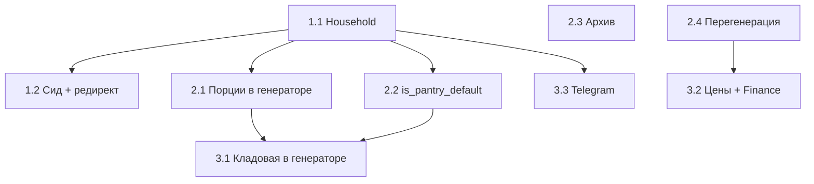

# План внедрения Food (MVP+)

**Дата:** 2026-05-16  
**Основа:** [decisions.md](./decisions.md), [domains.md](./domains.md), [roadmap.md](./roadmap.md)

Это **исполнительный план**: что делать, в каком порядке, backend/frontend, критерии готовности.  
`roadmap.md` — чеклист статуса; этот файл — **как реализовать**.

---

## Цель ближайших итераций

Закрыть ежедневный цикл для пары:

> сид и вход → меню на неделю (с порциями) → список покупок (умный) → напоминание в Telegram → (опционально) трата в Finance.

**Definition of Done** — см. [критерии MVP](#критерии-mvp-готов) в конце.

---

## Что уже есть (не переделывать)

| Область | Готово |
|---------|--------|
| Роуты `/food/*`, auth через `get_current_user` | ✅ |
| CRUD: категории, блюда, ингредиенты, состав, слоты меню | ✅ |
| Поле `servings` на `FoodMealSlot` (модель + UI + генератор) | ✅ |
| `servings_default`, `is_archived` на блюде + `db_bootstrap` | ✅ колонки есть |
| Генератор списка (без порций, без pantry, без pantry_default) | ✅ |
| UI: 5 вкладок, каталог, меню, гид, список, склад | ✅ |
| `telegram_reminder.py` | 🟡 код есть, не в cron |

**Пробелы относительно решений:** household в роутерах, сид блюд, редирект `/food`, UI порций/архива, логика генератора, диалог перегенерации, pantry в генераторе, цены, cron.

---

## Архитектурные заметки

### Household [D8]

В Finance данные на `user_id`; в Food — на `household_id` (общий дом для пары).

**Минимальная схема (рекомендуется для спринта 1):**

1. Таблица `households` (`id`) или колонка `users.household_id` (FK, default `1`).
2. Хелпер `app/food/deps.py` → `get_food_household_id(user: User) -> int`.
3. Все food-роутеры: заменить `MVP_HOUSEHOLD_ID` на `Depends(get_food_household_id)`.

Пока в БД один дом: оба Telegram-аккаунта с `household_id = 1`. Позже — «пригласить партнёра» без смены модели Food.

### Миграции

Проект использует `create_all` + `db_bootstrap.py` (additive DDL). Новые колонки — через `ensure_*` в bootstrap, не обязательно Alembic.

---

## Спринт 1 — Фундамент и первый вход (~3–5 дней)

### Epic 1.1 — Household из auth [D8]

| # | Задача | Слой |
|---|--------|------|
| 1.1.1 | `users.household_id` (nullable → backfill `1`) или таблица `households` | DB | ✅ |
| 1.1.2 | `get_food_household_id(user)` в `app/food/deps.py` | Backend | ✅ |
| 1.1.3 | Заменить `MVP_HOUSEHOLD_ID` во всех food-роутерах и `telegram_reminder` | Backend | ✅ |
| 1.1.4 | При регистрации/первом логине: `household_id = 1` если пусто | Backend | ✅ |
| 1.1.5 | Smoke: два разных `user_id`, один `household_id` — видят одно меню | Test | ✅ |

**Готово когда:** ни одного обращения к `MVP_HOUSEHOLD_ID` в роутерах; фильтры по `household_id` из deps.

---

### Epic 1.2 — Сид и онбординг [D10, D1]

| # | Задача | Слой |
|---|--------|------|
| 1.2.1 | `seed_default_dishes(household_id)` в `db_bootstrap` или отдельный `food_seed.py`: 5 блюд (омлет, паста, курица с гарниром, суп, салат), без ингредиентов | Backend | ✅ |
| 1.2.2 | Вызов сида при первом обращении к Food для household (флаг `food_seeded` или `count dishes == 0`) | Backend | ✅ |
| 1.2.3 | `GET /food/bootstrap` → `{ dish_count, categories_ready }` (опционально) | Backend | ✅ |
| 1.2.4 | Роут `/food` → редирект: `dish_count >= 3` → `/food/menu`, иначе `/food/catalog` | Frontend | ✅ |
| 1.2.5 | Баннер на каталоге: «Добавьте состав блюд — тогда список покупок соберётся сам» | Frontend | ✅ |

**Готово когда:** новый household после первого захода видит 5 блюд и попадает в Меню.

---

## Спринт 2 — Меню и список «по уму» (~4–6 дней)

### Epic 2.1 — Порции [D2, D6]

| # | Задача | Слой |
|---|--------|------|
| 2.1.1 | `shopping_generator`: множитель `slot.servings / max(dish.servings_default, 1)` на каждую строку состава | Backend | ✅ |
| 2.1.2 | API `PATCH menu/slots`: принимать/отдавать `servings` (уже в модели — проверить схемы) | Backend | ✅ |
| 2.1.3 | UI слота: stepper порций (дефолт 2) в bottom sheet меню | Frontend | ✅ |
| 2.1.4 | Гид: показывать порции слота рядом с названием | Frontend | ✅ |

**Готово когда:** ужин на 4 порции даёт ×2 ингредиентов относительно рецепта на 2.

---

### Epic 2.2 — «Всегда в кладовой» [D5]

| # | Задача | Слой |
|---|--------|------|
| 2.2.1 | Колонка `food_ingredients.is_pantry_default` + bootstrap | DB | ✅ |
| 2.2.2 | CRUD ингредиента: флаг в API и форме продукта | Backend + Frontend | ✅ |
| 2.2.3 | Генератор: пропускать строки, где `ingredient.is_pantry_default && !line.is_optional` | Backend | ✅ |
| 2.2.4 | Сид: соль, перец, масло растительное — `is_pantry_default=true` (по желанию) | Backend | ✅ |

---

### Epic 2.3 — Архив блюд [D4]

| # | Задача | Слой |
|---|--------|------|
| 2.3.1 | `GET /food/dishes?archived=false` по умолчанию; `?archived=true` для архива | Backend | ✅ |
| 2.3.2 | `PATCH` → `is_archived`; запрет hard delete если есть слоты (или только archive) | Backend | ✅ |
| 2.3.3 | Каталог: «В архив», фильтр; выбор в меню без архивных | Frontend | ✅ |

*Колонка `is_archived` уже в bootstrap — проверить использование в API/UI.*

---

### Epic 2.4 — Перегенерация списка [D3]

| # | Задача | Слой |
|---|--------|------|
| 2.4.1 | `POST /food/shopping-lists/generate` body: `{ from, to, mode: "new" \| "merge_draft" }` | Backend | ✅ |
| 2.4.2 | `mode=new`: предыдущий `active` → `done`; новый список | Backend | ✅ |
| 2.4.3 | `mode=merge_draft`: обновить только `draft`, пересобрать позиции `from_menu`, сохранить ручные | Backend | ✅ |
| 2.4.4 | Модалка при повторной генерации; дефолт «новый список» | Frontend | ✅ |

---

## Спринт 3 — Кладовая, деньги, Telegram (~4–5 дней)

### Epic 3.1 — Кладовая в генераторе

| # | Задача | Слой |
|---|--------|------|
| 3.1.1 | Загрузить `PantryItem` по household; для каждого ингредиента: `need - stock` (та же единица) | Backend | ✅ |
| 3.1.2 | Если единица pantry ≠ единица рецепта — не вычитать, badge в UI (фаза 2 D6) | Backend + Frontend | ✅ |
| 3.1.3 | После «куплено» — опционально «+ в склад» (можно отложить) | Frontend | отложено |

---

### Epic 3.2 — Цены и Finance [D7]

| # | Задача | Слой |
|---|--------|------|
| 3.2.1 | `food_shopping_items.actual_price` (Numeric) + bootstrap | DB | ✅ |
| 3.2.2 | `PATCH shopping-items/{id}` — цена; итог по списку в API | Backend | ✅ |
| 3.2.3 | UI: поле цены, сумма внизу списка | Frontend | ✅ |
| 3.2.4 | `POST shopping-lists/{id}/finalize` → `app/food/services/finance_bridge.py` → транзакция «Продукты» | Backend | ✅ |
| 3.2.5 | Кнопка «Оформить в Finance» после finalize | Frontend | ✅ |

*Валюта — из настроек Finance, не на позиции.*

---

### Epic 3.3 — Telegram [D9]

| # | Задача | Слой |
|---|--------|------|
| 3.3.1 | Таблица/ключ `food_reminder_sent (household_id, date)` — идемпотентность 1/сутки | DB | ✅ |
| 3.3.2 | Подключить `build_tomorrow_menu_message` к вечернему cron (как finance summary) | Backend | ✅ |
| 3.3.3 | `household_id` в reminder вместо константы | Backend | ✅ |
| 3.3.4 | (Опц.) Настройка времени в Settings | Backend + Frontend | отложено |

---

## Спринт Finalization — Покупки и готовность (~5–6 дней)

### Epic F1 — Единица в составе [D11]

| # | Задача | Слой |
|---|--------|------|
| F1.1 | При выборе ингредиента подставлять `default_unit_id`; подсказка при другой единице | Frontend | ✅ |

### Epic F2 — Статус блюда [D12]

| # | Задача | Слой |
|---|--------|------|
| F2.1 | `dish_pantry_status.py`, поле в GET dishes | Backend | ✅ |
| F2.2 | Badges 🟢/🟡/🔴 в каталоге | Frontend | ✅ |

### Epic F3 — Редактирование списка

| # | Задача | Слой |
|---|--------|------|
| F3.1 | PATCH quantity/unit_id | Backend | ✅ |
| F3.2 | UI в `FoodShoppingPage` | Frontend | ✅ |

### Epic F4 — Кладовая из списка [D13]

| # | Задача | Слой |
|---|--------|------|
| F4.1 | `pantry_applied_at`, apply-to-pantry | Backend | ✅ |
| F4.2 | UI при checked + batch | Frontend | ✅ |

### Epic F5 — Недостающее из блюда

| # | Задача | Слой |
|---|--------|------|
| F5.1 | `shopping-shortfall` | Backend | ✅ |
| F5.2 | CTA в каталоге | Frontend | ✅ |

---

## Спринт 4 — Удобство (после MVP)

| Epic | Содержание | Приоритет |
|------|------------|-----------|
| 4.1 | Повтор прошлой недели | P1 | ✅ |
| 4.2 | Завершение списка (`status=done`) UX | P1 | ✅ |
| 4.3 | Режим «в магазине» | P2 |
| 4.4 | Теги блюд | P2 |
| 4.5 | Шаблоны недели | P2 |
| 4.6 | AI-черновик меню | P3 |

---

## Зависимости (граф)

---

## Критерии MVP-готов

Из [roadmap.md](./roadmap.md), с уточнением после решений:

- [x] Первый заход: 5 блюд в каталоге, редирект в **Меню**
- [x] Неделя заполняется (&lt; 10 мин); порции в слоте влияют на список
- [x] Список из меню: без `is_pantry_default`, с учётом порций
- [x] Перегенерация — диалог, дефолт «новый список»
- [x] Архив блюда не ломает прошлые слоты
- [x] Telegram: 1 сообщение «завтра» в сутки на дом
- [x] (Желательно) finalize списка → одна трата в Finance

---

## Риски и как снять

| Риск | Митигация |
|------|-----------|
| Нет таблицы `households`, пара на разных `user_id` | Явный `household_id` на user + ручной backfill; позже invite flow |
| `servings` в UI не было | Поле в БД есть — только generator + UI |
| Два списка `active` | При `mode=new` закрывать предыдущий active |
| Finance не знает категорию «Продукты» | Завести категорию в сиде Finance или конфиг id |

---

## Связь документов

| Документ | Роль |
|----------|------|
| [decisions.md](./decisions.md) | Что решили |
| [plan.md](./plan.md) | **Как делаем (этот файл)** |
| [roadmap.md](./roadmap.md) | Статус фаз ✅/❌ |
| [domains.md](./domains.md) | Продуктовые правила |
| [user-flows.md](./user-flows.md) | Сценарии для QA |

После каждого спринта — обновлять чеклисты в `roadmap.md` и отмечать эпики здесь.
